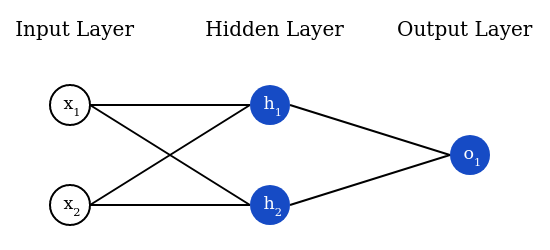

# 2. Combining Neurons into a Neural Network
A neural network is nothing more than a bunch of neurons connected together. Here’s what a simple neural network might look like:



This network has 2 inputs, a hidden layer with 2 neurons (h1 and h2), and an output layer with 1 neuron (o1). 
Notice that the inputs for o₁ are the outputs from h1 and h2 - that’s what makes this a network.

> A **hidden layer** is any layer between the input (first) layer and output (last) layer. There can be multiple hidden layers! 


## Example: Feedforward
Let’s use the network pictured above and assume all neurons have the same weights ω = [0, 1], the same bias b = 0, and the same sigmoid activation function. 
Let 𝙝₁, 𝙝₂, 𝒐₁ denote the outputs of the neurons they represent.

What happens if we pass in the input x = [2, 3]?
```
   𝙝₁ = 𝙝₂ = 𝒇(ω * 𝙭 + 𝙗)
           = 𝒇(0*2 + 1*3 + 0)
           = 𝒇(3)
           = 0.9526
   𝒐₁ = 𝒇(ω * [𝙝₁,𝙝₂] + 𝙗)
      = 𝒇(0*𝙝₁ + 1*𝙝₂ + 0)
      = 𝒇(0.9526)
      = 0.7216
```
The output of the neural network for input x = [2, 3] is 0.7216. Pretty simple, right?

A neural network can have **any number of layers** with **any number of neurons in those layers**. The basic idea stays the same: feed the input(s) forward through the neurons in the network to get the output(s) at the end. For simplicity, we’ll keep using the network pictured above for the rest of this post.


## Coding a Neural Network: Feedforward
Let’s implement feedforward for our neural network. Here’s the image of the network again for reference:


```python
import numpy as np

def sigmoid(x):
  # Our activation function: f(x) = 1 / (1 + e^(-x))
  return 1 / (1 + np.exp(-x))

class Neuron:
  def __init__(self, weights, bias):
    self.weights = weights
    self.bias = bias

  def feedforward(self, inputs):
    # Weight inputs, add bias, then use the activation function
    total = np.dot(self.weights, inputs) + self.bias
    return sigmoid(total)

class OurNeuralNetwork:
  '''
  A neural network with:
    - 2 inputs
    - a hidden layer with 2 neurons (h1, h2)
    - an output layer with 1 neuron (o1)
  Each neuron has the same weights and bias:
    - w = [0, 1]
    - b = 0
  '''
  def __init__(self):
    weights = np.array([0, 1])
    bias = 0

    # The Neuron class here is from the previous section
    self.h1 = Neuron(weights, bias)
    self.h2 = Neuron(weights, bias)
    self.o1 = Neuron(weights, bias)

  def feedforward(self, x):
    out_h1 = self.h1.feedforward(x)
    out_h2 = self.h2.feedforward(x)

    # The inputs for o1 are the outputs from h1 and h2
    out_o1 = self.o1.feedforward(np.array([out_h1, out_h2]))

    return out_o1

network = OurNeuralNetwork()
x = np.array([2, 3])
print(network.feedforward(x)) # 0.7216325609518421
```
We got 0.7216 again! Looks like it works.
