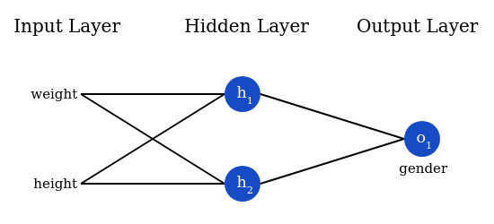

# 3. Training a Neural Network

## Part 1
Say we have the following measurements:

| Name    | 	Weight(lb) | 	Height(in) | 	Gender |
|---------|-------------|-------------|---------|
| Alice   | 	133        | 	65	        | F       |
| Bob     | 	160        | 	72         | 	M      |
| Charlie | 	152        | 	70	        | M       |
| Diana   | 	120        | 	60         | 	F      |

Let’s train our network to predict someone’s gender given their weight and height:



We’ll represent Male with 0 and Female with 1, and we’ll also shift the data to make it easier to use:

| Name	    | Weight(minus 135)	 | Height(minus 66)	 | Gender |
|----------|--------------------|-------------------|--------|
| Alice	   | -2	                | -1	               | 1      |
| Bob	     | 25	                | 6	                | 0      |
| Charlie	 | 17	                | 4	                | 0      |
| Diana	   | -15	               | -6	               | 1      |

>I arbitrarily chose the shift amounts (**135** and **66**) to make the numbers look nice. Normally, you’d shift by the mean.

### Loss
Before we train our network, we first need a way to quantify how “good” it’s doing so that it can try to do “better”. That’s what the loss is.

We’ll use the **mean squared error** (MSE) loss:
```
   $MSE = \frac{1}{n} \sum_{i=1}^{n}(y_{true}-y_{pred})^2$
```

