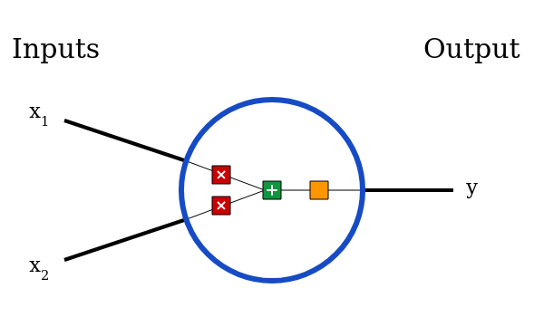
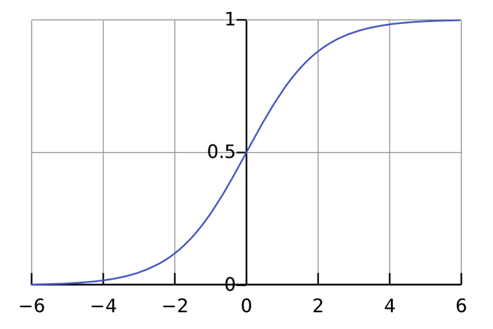

# Machine Learning for Beginners: An Introduction to Neural Networks
A simple explanation of how they work and how to implement one from scratch in Python.

Here’s something that might surprise you: neural networks aren’t that complicated! The term “neural network” gets used as a buzzword a lot, but in reality they’re often much simpler than people imagine.

This post is intended for complete beginners and assumes ZERO prior knowledge of machine learning. We’ll understand how neural networks work while implementing one from scratch in Python.

Let’s get started!

## 1. Building Blocks: Neurons
First, we have to talk about neurons, the basic unit of a neural network. A neuron takes inputs, does some math with them, and produces one output. Here’s what a 2-input neuron looks like:



3 things are happening here.

First, each input is multiplied by a weight:
```
   x₁ → x₁ * ω₁
   x₂ → x₂ * ω₂
```

Next, all the weighted inputs are added together with a bias bb: 
```
    x₁ * ω₁ + x₂ * ω₂ + b
```

Finally, the sum is passed through an activation function: 
```
    y = f( x₁ * ω₁ + x₂ * ω₂ + b )
```


The activation function is used to turn an unbounded input into an output that has a nice, predictable form. A commonly used activation function is the sigmoid function:


The sigmoid function only outputs numbers in the range (0, 1). You can think of it as compressing (−∞,+∞) to (0,1) - big negative numbers become ~0, and big positive numbers become ~1.

### A Simple Example
Assume we have a 2-input neuron that uses the sigmoid activation function and has the following parameters:
```
    ω = [0, 1]
    b = 4
```

ω = [0, 1] is just a way of writing ω₁ = 0, ω₂ = 1 in vector form. Now, let’s give the neuron an input of x = [2, 3]. We’ll use the dot product to write things more concisely:
```
    (w*x) + b = ((x₁*ω₁) + (x₂*ω₂)) + b
              = 0∗2 + 1∗3 + 4
              = 7
    y = f(ω*x + b)
      = f(7)
      = 0.999  
```
The neuron outputs 0.999 given the inputs x = [2, 3]. That’s it! This process of passing inputs forward to get an output is known as feedforward.


### Coding a Neuron
Time to implement a neuron! We’ll use NumPy, a popular and powerful computing library for Python, to help us do math:
```python
import numpy as np

def sigmoid(x):
  # Our activation function: f(x) = 1 / (1 + e^(-x))
  return 1 / (1 + np.exp(-x))

class Neuron:
  def __init__(self, weights, bias):
    self.weights = weights
    self.bias = bias

  def feedforward(self, inputs):
    # Weight inputs, add bias, then use the activation function
    total = np.dot(self.weights, inputs) + self.bias
    return sigmoid(total)

weights = np.array([0, 1]) # w1 = 0, w2 = 1
bias = 4                   # b = 4
n = Neuron(weights, bias)

x = np.array([2, 3])       # x1 = 2, x2 = 3
print(n.feedforward(x))    # 0.9990889488055994
```
Recognize those numbers? That’s the example we just did! We get the same answer of 0.999.

