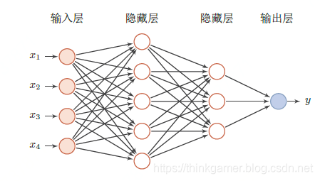

## 解释

### Feedforward Neural Network，FNN
前馈神经网络

第0 层叫输入层，最后一层叫输出层，其它中间层叫做隐藏层。
整个网络中无反馈，信号从输入层向输出层单向传播，可用一个有向无环图表示 。
（每一层的神经元可以接收前一层神经元的信号，并产生信号输出到下一层）

> 前馈神经网络也经常称为多层感知器（Multi-Layer Perceptron，MLP）。

